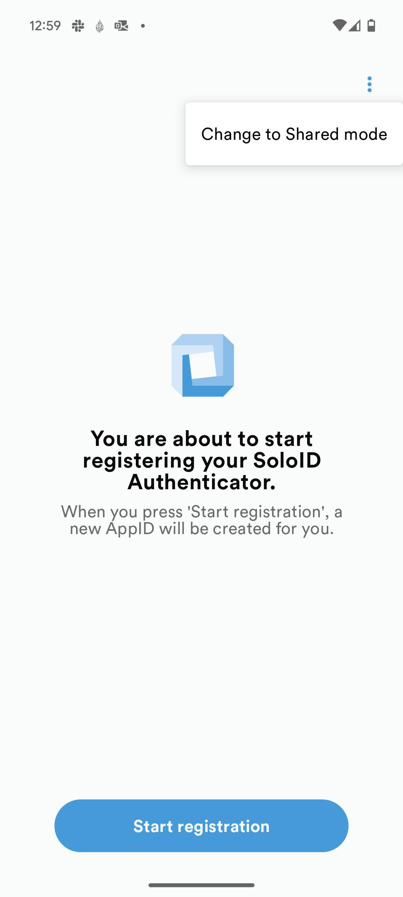
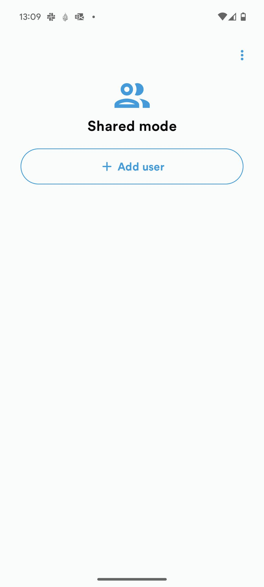
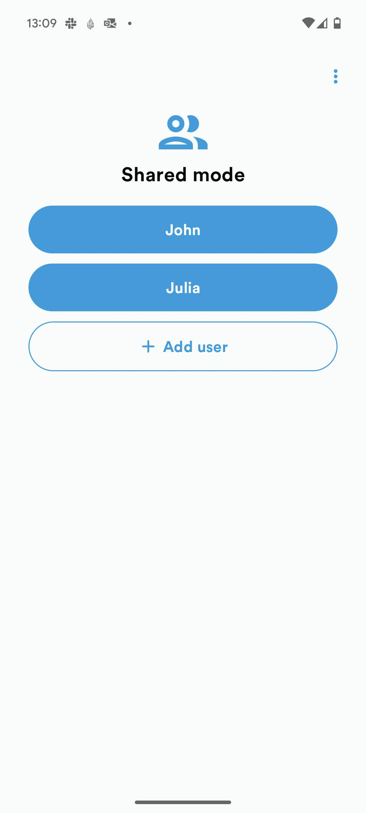

# Device modes

SoloID Authenticator supports two modes of operation
* Standard (default)
* Shared

It is also an option to share the same SoloID Authenticator app between multiple users, which will disable the use of the built-in lockscreen and instead utilize a per-user server-side validated pincode. 

For both modes of operation a unique AppID is generated pr. app-instance, which for Shared Mode is pr. user. Each user has their own unique AppID pr. device they are using and each of these are built as stand-alone SoloID Authenticator devices.

## Standard Mode
The default behavior is to allow the user to utilize the Android or iOS built-in lockscreen to safeguard a hardware backed cryptographic key used by SoloID Authenticator. 

## Shared Mode
SoloID Authenticator Shared Model can be activated from the initial registration screen using the three "dots" up in the right corner.

  
  
  

This allows for multiple users to utilize the same shared device and have their own personal SoloID Authenticator device on the device. 
Each user creates their own server-side validated pincode, which has to be used when opening and approving flows from the device. 

### Service restriction on devices
From a security perspective the shared device setting is less secure compared with a personal physical device. 
It is possible for integrating services to see and restrict the usage and approvals from shared devices when starting or receiving responses from the SoloID Authenticator API.

Note however, that the server-side validated pincode often scores higher in security ratings when compared to the biometric protection often offered by the Android and IOS lockscreens.

The information is available for integrating services, to make their own security decisions based on devices being used.
