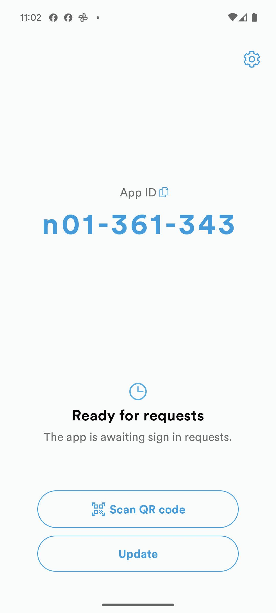

# Device registration

## Identifying a SoloID Authenticator Device

A SoloID Authenticator device is uniquely identified by its SoloID Authenticator AppID, which is provided upon successful authentication. The AppID remains constant for a specific device unless the SoloID Authenticator app or device is reset. In such cases, the old authentication keys stored securely on the device become unusable, and new keys are created for a new AppID.

The end-user can view their AppID at the top section of the main SoloID Authenticator screen, as shown below:

  

## Registering an AppID

To initiate a SoloID Authenticator flow, a service must identify one or more SoloID Authenticator devices authorized to approve the flow or receive a secure OTP. Each device is uniquely identified by its AppID, allowing a service to specify one or more AppIDs when starting a flow.

It is the responsibility of the integrating service to create an enrollment process for one or more SoloID Authenticators for their users.

### Initiating an Open SoloID Authenticator Flow

A common approach involves setting up a sufficiently secure session with the end-user and then initiating a new "open" SoloID Authenticator flow. This can be done using the QR code or app switch functionality to have the end-user approve the SoloID flow and register the received AppID.

An "open" SoloID Authenticator flow is initiated by omitting the specification of any particular AppIDs and requires channel binding. If the end-user is unable to scan QR codes or use the app switch functionality, the service can request the user to enter their own AppID as seen at the top of the app. The service can then initiate a new flow based on the AppID submitted by the end-user.
